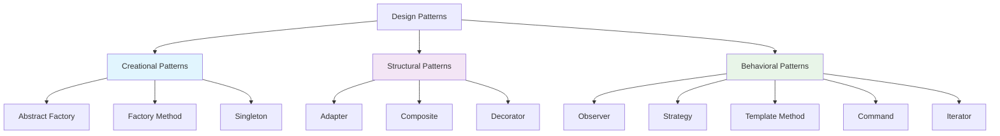
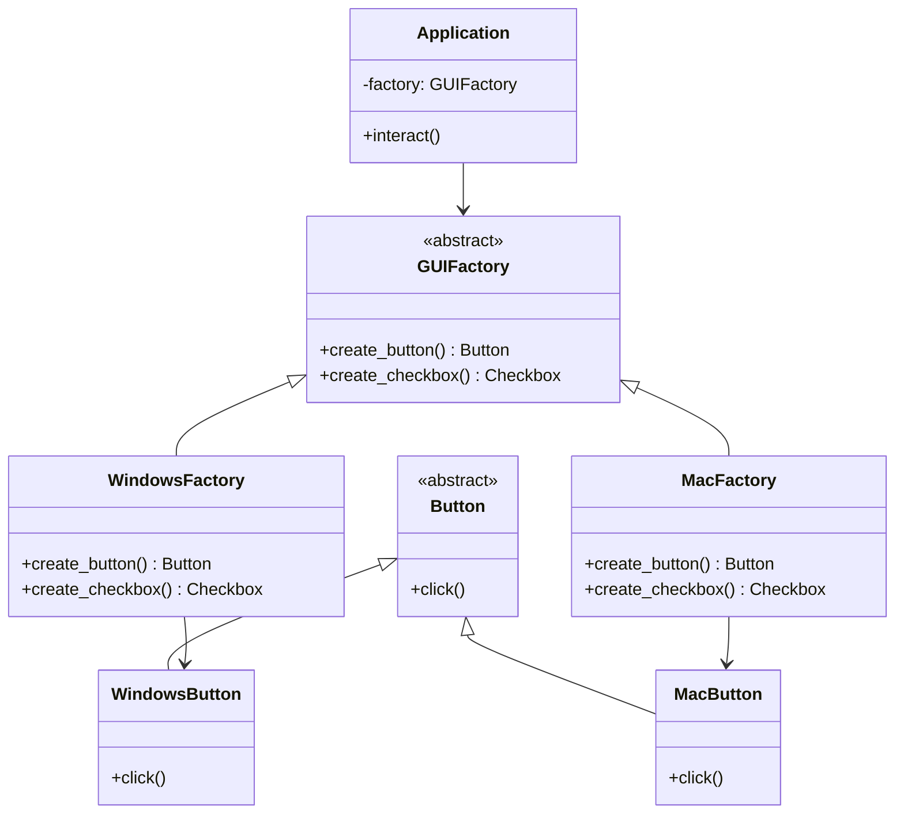
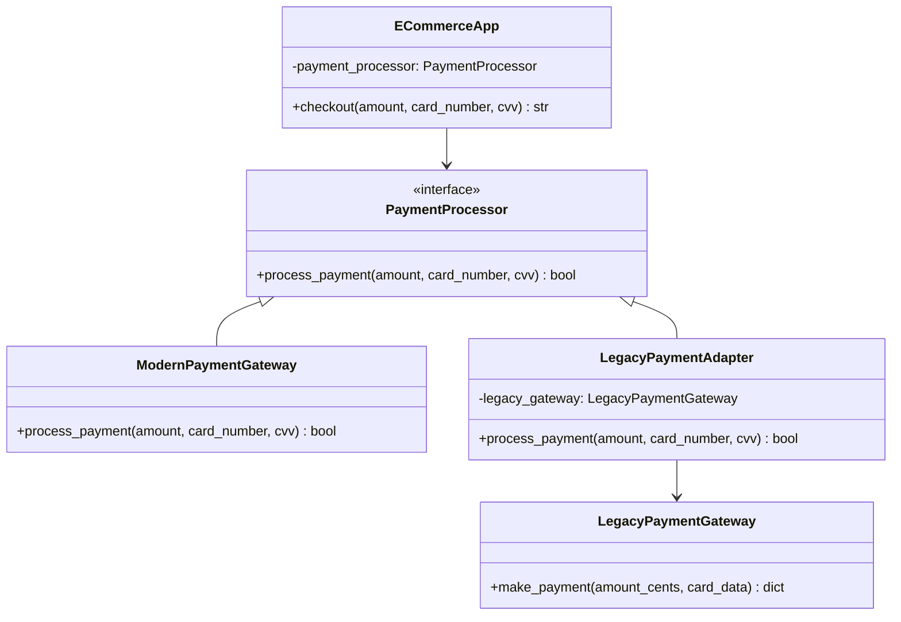

# Object-Oriented Design Patterns in Python

Design patterns are **recurring object-oriented designs** that provide proven solutions to common design problems. They make proven techniques more accessible to developers, help in choosing designs that make systems more reusable, and facilitate documentation and communication.

## Pattern Classification



-----

## Creational Patterns

Creational patterns **abstract the instantiation process** by encapsulating knowledge about which concrete classes the system uses and hiding how instances are created.

### Abstract Factory Pattern

> **Intent**: Provide an interface for creating families of related objects without specifying their concrete classes.

#### The Problem

```python
# ❌ Without Abstract Factory - tight coupling to specific implementations
class WindowsButton:
    def click(self):
        return "Windows button clicked"

class MacButton:
    def click(self):
        return "Mac button clicked"

class Application:
    def __init__(self, os_type):
        # Tight coupling - violates OCP and DIP
        if os_type == "windows":
            self.button = WindowsButton()
        elif os_type == "mac":
            self.button = MacButton()
        else:
            raise ValueError("Unsupported OS")
```

#### The Solution

```python
# ✅ Abstract Factory Pattern
from abc import ABC, abstractmethod

# Abstract Products
class Button(ABC):
    @abstractmethod
    def click(self):
        pass

class Checkbox(ABC):
    @abstractmethod
    def check(self):
        pass

# Abstract Factory
class GUIFactory(ABC):
    @abstractmethod
    def create_button(self) -> Button:
        pass
    
    @abstractmethod
    def create_checkbox(self) -> Checkbox:
        pass

# Concrete Products - Windows Family
class WindowsButton(Button):
    def click(self):
        return "Windows button clicked"

class WindowsCheckbox(Checkbox):
    def check(self):
        return "Windows checkbox checked"

# Concrete Products - Mac Family
class MacButton(Button):
    def click(self):
        return "Mac button clicked"

class MacCheckbox(Checkbox):
    def check(self):
        return "Mac checkbox checked"

# Concrete Factories
class WindowsFactory(GUIFactory):
    def create_button(self) -> Button:
        return WindowsButton()
    
    def create_checkbox(self) -> Checkbox:
        return WindowsCheckbox()

class MacFactory(GUIFactory):
    def create_button(self) -> Button:
        return MacButton()
    
    def create_checkbox(self) -> Checkbox:
        return MacCheckbox()

# Client Code
class Application:
    def __init__(self, factory: GUIFactory):
        self.factory = factory
        self.button = factory.create_button()
        self.checkbox = factory.create_checkbox()
    
    def interact(self):
        return f"{self.button.click()}, {self.checkbox.check()}"

# Usage
windows_app = Application(WindowsFactory())
mac_app = Application(MacFactory())

print(windows_app.interact())  # Windows button clicked, Windows checkbox checked
print(mac_app.interact())      # Mac button clicked, Mac checkbox checked
```

#### Abstract Factory Structure



-----

### Factory Method Pattern

> **Intent**: Define an interface for creating objects, but let subclasses decide which class to instantiate.

#### Real-World Example: Document Processing

```python
from abc import ABC, abstractmethod
from typing import List

# Product Interface
class Document(ABC):
    @abstractmethod
    def save(self) -> str:
        pass
    
    @abstractmethod
    def export(self) -> str:
        pass

# Concrete Products
class PDFDocument(Document):
    def save(self) -> str:
        return "PDF document saved"
    
    def export(self) -> str:
        return "PDF exported"

class WordDocument(Document):
    def save(self) -> str:
        return "Word document saved"
    
    def export(self) -> str:
        return "Word document exported"

class PowerPointDocument(Document):
    def save(self) -> str:
        return "PowerPoint document saved"
    
    def export(self) -> str:
        return "PowerPoint exported"

# Creator (Abstract Factory)
class DocumentProcessor(ABC):
    """Template method that uses factory method"""
    
    def process_document(self, content: str) -> List[str]:
        # Template method defining the algorithm
        doc = self.create_document()  # Factory method call
        results = []
        results.append(f"Processing: {content}")
        results.append(doc.save())
        results.append(doc.export())
        return results
    
    @abstractmethod
    def create_document(self) -> Document:
        """Factory method - to be implemented by subclasses"""
        pass

# Concrete Creators
class PDFProcessor(DocumentProcessor):
    def create_document(self) -> Document:
        return PDFDocument()

class WordProcessor(DocumentProcessor):
    def create_document(self) -> Document:
        return WordDocument()

class PowerPointProcessor(DocumentProcessor):
    def create_document(self) -> Document:
        return PowerPointDocument()

# Usage
def process_documents():
    processors = [
        PDFProcessor(),
        WordProcessor(),
        PowerPointProcessor()
    ]
    
    for processor in processors:
        results = processor.process_document("Sample content")
        print(f"{processor.__class__.__name__}: {results}")

# Advanced: Registration-based Factory
class DocumentFactory:
    """Registry pattern for dynamic factory method"""
    _creators = {}
    
    @classmethod
    def register_creator(cls, doc_type: str, creator: DocumentProcessor):
        cls._creators[doc_type] = creator
    
    @classmethod
    def create_processor(cls, doc_type: str) -> DocumentProcessor:
        creator = cls._creators.get(doc_type)
        if not creator:
            raise ValueError(f"Unknown document type: {doc_type}")
        return creator

# Register creators
DocumentFactory.register_creator("pdf", PDFProcessor())
DocumentFactory.register_creator("word", WordProcessor())
DocumentFactory.register_creator("ppt", PowerPointProcessor())

# Dynamic creation
processor = DocumentFactory.create_processor("pdf")
```

-----

### Singleton Pattern

> **Intent**: Ensure a class has only one instance and provide global access to it.

#### Thread-Safe Singleton Implementation

```python
import threading
from typing import Optional

class DatabaseConnection:
    """Thread-safe Singleton database connection"""
    
    _instance: Optional['DatabaseConnection'] = None
    _lock = threading.Lock()
    
    def __new__(cls) -> 'DatabaseConnection':
        if cls._instance is None:
            with cls._lock:
                # Double-checked locking pattern
                if cls._instance is None:
                    cls._instance = super().__new__(cls)
                    cls._instance._initialized = False
        return cls._instance
    
    def __init__(self):
        if self._initialized:
            return
        
        self.connection_string = "database://localhost:5432"
        self.is_connected = False
        self._initialized = True
    
    def connect(self) -> str:
        if not self.is_connected:
            self.is_connected = True
            return f"Connected to {self.connection_string}"
        return "Already connected"
    
    def disconnect(self) -> str:
        if self.is_connected:
            self.is_connected = False
            return "Disconnected from database"
        return "Already disconnected"

# Modern Python approach using decorator
def singleton(cls):
    """Singleton decorator"""
    instances = {}
    lock = threading.Lock()
    
    def get_instance(*args, **kwargs):
        if cls not in instances:
            with lock:
                if cls not in instances:
                    instances[cls] = cls(*args, **kwargs)
        return instances[cls]
    
    return get_instance

@singleton
class ConfigManager:
    """Configuration manager using decorator pattern"""
    
    def __init__(self):
        self.config = {
            'debug': True,
            'database_url': 'postgresql://localhost:5432/mydb',
            'api_key': 'secret-key-123'
        }
    
    def get(self, key: str) -> str:
        return self.config.get(key, '')
    
    def set(self, key: str, value: str) -> None:
        self.config[key] = value

# Usage examples
def test_singleton():
    # Traditional singleton
    db1 = DatabaseConnection()
    db2 = DatabaseConnection()
    
    print(f"Same instance: {db1 is db2}")  # True
    print(db1.connect())
    
    # Decorator-based singleton
    config1 = ConfigManager()
    config2 = ConfigManager()
    
    print(f"Same config: {config1 is config2}")  # True
    config1.set('new_setting', 'value')
    print(f"Shared state: {config2.get('new_setting')}")  # value
```

-----

## Structural Patterns

Structural patterns are concerned with **how classes and objects are composed** to form larger structures.

### Adapter Pattern

> **Intent**: Convert the interface of a class into another interface clients expect.

#### Legacy System Integration

```python
# Legacy payment system (Adaptee)
class LegacyPaymentGateway:
    """Old payment system with different interface"""
    
    def __init__(self, api_key: str):
        self.api_key = api_key
    
    def make_payment(self, amount_cents: int, card_data: dict) -> dict:
        # Legacy system works with cents and different data format
        return {
            'transaction_id': f"txn_{amount_cents}_{hash(str(card_data))}",
            'status_code': 200 if amount_cents > 0 else 400,
            'message': 'Payment processed' if amount_cents > 0 else 'Invalid amount'
        }

# Modern interface that clients expect (Target)
class PaymentProcessor(ABC):
    @abstractmethod
    def process_payment(self, amount: float, card_number: str, cvv: str) -> bool:
        pass

# Modern implementation
class ModernPaymentGateway(PaymentProcessor):
    def process_payment(self, amount: float, card_number: str, cvv: str) -> bool:
        # Modern implementation
        if amount > 0 and len(card_number) == 16:
            print(f"Processing ${amount} payment")
            return True
        return False

# Adapter to make legacy system work with modern interface
class LegacyPaymentAdapter(PaymentProcessor):
    """Adapter to integrate legacy payment gateway"""
    
    def __init__(self, legacy_gateway: LegacyPaymentGateway):
        self.legacy_gateway = legacy_gateway
    
    def process_payment(self, amount: float, card_number: str, cvv: str) -> bool:
        # Convert modern interface to legacy format
        amount_cents = int(amount * 100)
        card_data = {
            'number': card_number,
            'cvv': cvv
        }
        
        # Call legacy system
        result = self.legacy_gateway.make_payment(amount_cents, card_data)
        
        # Convert legacy response to modern format
        return result['status_code'] == 200

# Client code
class ECommerceApp:
    def __init__(self, payment_processor: PaymentProcessor):
        self.payment_processor = payment_processor
    
    def checkout(self, amount: float, card_number: str, cvv: str) -> str:
        if self.payment_processor.process_payment(amount, card_number, cvv):
            return "Payment successful!"
        return "Payment failed!"

# Usage
legacy_gateway = LegacyPaymentGateway("legacy-api-key")
adapter = LegacyPaymentAdapter(legacy_gateway)

# Client can use legacy system through modern interface
app = ECommerceApp(adapter)
result = app.checkout(99.99, "1234567890123456", "123")
print(result)  # Payment successful!

# Can also use modern implementation
modern_gateway = ModernPaymentGateway()
modern_app = ECommerceApp(modern_gateway)
```

#### Adapter Pattern Structure



-----

### Composite Pattern

> **Intent**: Compose objects into tree structures to represent part-whole hierarchies.

#### File System Example

```python
from abc import ABC, abstractmethod
from typing import List
from datetime import datetime

# Component interface
class FileSystemComponent(ABC):
    """Common interface for files and directories"""
    
    def __init__(self, name: str):
        self.name = name
        self.created_at = datetime.now()
    
    @abstractmethod
    def get_size(self) -> int:
        pass
    
    @abstractmethod
    def display(self, indent: int = 0) -> str:
        pass
    
    @abstractmethod
    def search(self, name: str) -> List['FileSystemComponent']:
        pass

# Leaf - represents files
class File(FileSystemComponent):
    """Leaf component - cannot contain other components"""
    
    def __init__(self, name: str, content: str = ""):
        super().__init__(name)
        self.content = content
    
    def get_size(self) -> int:
        return len(self.content)
    
    def display(self, indent: int = 0) -> str:
        spacing = "  " * indent
        return f"{spacing}📄 {self.name} ({self.get_size()} bytes)"
    
    def search(self, name: str) -> List[FileSystemComponent]:
        if name.lower() in self.name.lower():
            return [self]
        return []

# Composite - represents directories
class Directory(FileSystemComponent):
    """Composite component - can contain other components"""
    
    def __init__(self, name: str):
        super().__init__(name)
        self.children: List[FileSystemComponent] = []
    
    def add(self, component: FileSystemComponent) -> None:
        self.children.append(component)
    
    def remove(self, component: FileSystemComponent) -> None:
        self.children.remove(component)
    
    def get_size(self) -> int:
        return sum(child.get_size() for child in self.children)
    
    def display(self, indent: int = 0) -> str:
        spacing = "  " * indent
        result = f"{spacing}📁 {self.name}/ ({self.get_size()} bytes total)\n"
        
        for child in self.children:
            result += child.display(indent + 1) + "\n"
        
        return result.rstrip()
    
    def search(self, name: str) -> List[FileSystemComponent]:
        results = []
        
        # Check if directory name matches
        if name.lower() in self.name.lower():
            results.append(self)
        
        # Search in children
        for child in self.children:
            results.extend(child.search(name))
        
        return results

# Advanced: Add permission handling
class SecureFile(File):
    """File with permission handling"""
    
    def __init__(self, name: str, content: str = "", read_only: bool = False):
        super().__init__(name, content)
        self.read_only = read_only
    
    def write(self, content: str) -> bool:
        if self.read_only:
            return False
        self.content = content
        return True

# Usage example
def create_file_system():
    # Create root directory
    root = Directory("root")
    
    # Create subdirectories
    documents = Directory("Documents")
    pictures = Directory("Pictures")
    projects = Directory("Projects")
    
    # Create files
    readme = File("README.md", "# Project Documentation\nThis is a sample project.")
    config = SecureFile("config.json", '{"api_key": "secret"}', read_only=True)
    photo1 = File("vacation.jpg", "binary_image_data_here")
    photo2 = File("family.png", "more_binary_data")
    
    # Create project structure
    python_project = Directory("python-app")
    main_py = File("main.py", "print('Hello, World!')")
    requirements = File("requirements.txt", "flask==2.0.1\nrequests==2.25.1")
    
    # Build the tree structure
    root.add(documents)
    root.add(pictures)
    root.add(projects)
    
    documents.add(readme)
    documents.add(config)
    
    pictures.add(photo1)
    pictures.add(photo2)
    
    projects.add(python_project)
    python_project.add(main_py)
    python_project.add(requirements)
    
    return root

# Demonstration
fs = create_file_system()
print("File System Structure:")
print(fs.display())

print(f"\nTotal size: {fs.get_size()} bytes")

print("\nSearching for 'py':")
results = fs.search("py")
for result in results:
    print(f"Found: {result.name}")
```

-----

### Decorator Pattern

> **Intent**: Attach additional responsibilities to an object dynamically.

#### Coffee Shop Example

```python
from abc import ABC, abstractmethod

# Component interface
class Coffee(ABC):
    @abstractmethod
    def cost(self) -> float:
        pass
    
    @abstractmethod
    def description(self) -> str:
        pass

# Concrete component
class SimpleCoffee(Coffee):
    def cost(self) -> float:
        return 2.0
    
    def description(self) -> str:
        return "Simple coffee"

# Base decorator
class CoffeeDecorator(Coffee):
    """Base decorator class"""
    
    def __init__(self, coffee: Coffee):
        self._coffee = coffee
    
    def cost(self) -> float:
        return self._coffee.cost()
    
    def description(self) -> str:
        return self._coffee.description()

# Concrete decorators
class MilkDecorator(CoffeeDecorator):
    def cost(self) -> float:
        return self._coffee.cost() + 0.5
    
    def description(self) -> str:
        return self._coffee.description() + ", milk"

class SugarDecorator(CoffeeDecorator):
    def cost(self) -> float:
        return self._coffee.cost() + 0.2
    
    def description(self) -> str:
        return self._coffee.description() + ", sugar"

class WhippedCreamDecorator(CoffeeDecorator):
    def cost(self) -> float:
        return self._coffee.cost() + 0.7
    
    def description(self) -> str:
        return self._coffee.description() + ", whipped cream"

class CaramelDecorator(CoffeeDecorator):
    def cost(self) -> float:
        return self._coffee.cost() + 0.6
    
    def description(self) -> str:
        return self._coffee.description() + ", caramel"

# Advanced: Function-based decorator approach
def add_milk(coffee: Coffee) -> Coffee:
    """Functional approach to decoration"""
    
    class MilkDecorated(Coffee):
        def cost(self) -> float:
            return coffee.cost() + 0.5
        
        def description(self) -> str:
            return coffee.description() + ", milk"
    
    return MilkDecorated()

# Usage examples
def coffee_shop_demo():
    # Start with simple coffee
    coffee = SimpleCoffee()
    print(f"{coffee.description()}: ${coffee.cost():.2f}")
    
    # Add milk
    coffee = MilkDecorator(coffee)
    print(f"{coffee.description()}: ${coffee.cost():.2f}")
    
    # Add sugar
    coffee = SugarDecorator(coffee)
    print(f"{coffee.description()}: ${coffee.cost():.2f}")
    
    # Add whipped cream
    coffee = WhippedCreamDecorator(coffee)
    print(f"{coffee.description()}: ${coffee.cost():.2f}")
    
    # Add caramel
    coffee = CaramelDecorator(coffee)
    print(f"{coffee.description()}: ${coffee.cost():.2f}")

# Real-world example: Web middleware
class HTTPRequest:
    def __init__(self, path: str, method: str = "GET"):
        self.path = path
        self.method = method
        self.headers = {}
        self.authenticated = False

class RequestHandler(ABC):
    @abstractmethod
    def handle(self, request: HTTPRequest) -> str:
        pass

class BaseHandler(RequestHandler):
    def handle(self, request: HTTPRequest) -> str:
        return f"Handling {request.method} {request.path}"

class AuthenticationDecorator(RequestHandler):
    def __init__(self, handler: RequestHandler):
        self.handler = handler
    
    def handle(self, request: HTTPRequest) -> str:
        if not request.authenticated:
            return "Authentication required"
        return self.handler.handle(request)

class LoggingDecorator(RequestHandler):
    def __init__(self, handler: RequestHandler):
        self.handler = handler
    
    def handle(self, request: HTTPRequest) -> str:
        print(f"LOG: Incoming request {request.method} {request.path}")
        result = self.handler.handle(request)
        print(f"LOG: Response: {result}")
        return result

# Middleware stack demonstration
handler = BaseHandler()
handler = AuthenticationDecorator(handler)
handler = LoggingDecorator(handler)

request = HTTPRequest("/api/users")
print(handler.handle(request))
```

-----

## Behavioral Patterns

Behavioral patterns are concerned with **algorithms and the assignment of responsibilities** between objects.

### Observer Pattern

> **Intent**: Define a one-to-many dependency between objects so that when one object changes state, all dependents are notified.

#### Stock Market Example

```python
from abc import ABC, abstractmethod
from typing import List, Dict
from enum import Enum

# Subject interface
class Subject(ABC):
    @abstractmethod
    def attach(self, observer: 'Observer') -> None:
        pass
    
    @abstractmethod
    def detach(self, observer: 'Observer') -> None:
        pass
    
    @abstractmethod
    def notify(self) -> None:
        pass

# Observer interface
class Observer(ABC):
    @abstractmethod
    def update(self, subject: Subject) -> None:
        pass

# Concrete Subject
class Stock(Subject):
    """Stock that notifies observers of price changes"""
    
    def __init__(self, symbol: str, price: float):
        self.symbol = symbol
        self._price = price
        self._observers: List[Observer] = []
    
    def attach(self, observer: Observer) -> None:
        if observer not in self._observers:
            self._observers.append(observer)
            print(f"📊 {observer.__class__.__name__} subscribed to {self.symbol}")
    
    def detach(self, observer: Observer) -> None:
        if observer in self._observers:
            self._observers.remove(observer)
            print(f"📊 {observer.__class__.__name__} unsubscribed from {self.symbol}")
    
    def notify(self) -> None:
        print(f"📈 {self.symbol} price changed to ${self._price:.2f}")
        for observer in self._observers:
            observer.update(self)
    
    @property
    def price(self) -> float:
        return self._price
    
    @price.setter
    def price(self, price: float) -> None:
        if price != self._price:
            self._price = price
            self.notify()

# Concrete Observers
class Trader(Observer):
    """Trader that responds to stock price changes"""
    
    def __init__(self, name: str):
        self.name = name
        self.portfolio: Dict[str, int] = {}
    
    def update(self, subject: Subject) -> None:
        if isinstance(subject, Stock):
            if subject.price > 100:
                print(f"💰 {self.name}: Time to sell {subject.symbol}!")
            elif subject.price < 50:
                print(f"💸 {self.name}: Great buying opportunity for {subject.symbol}!")
            else:
                print(f"📋 {self.name}: Monitoring {subject.symbol} at ${subject.price:.2f}")

class PriceAlert(Observer):
    """Alert system for price thresholds"""
    
    def __init__(self, threshold: float, alert_type: str = "above"):
        self.threshold = threshold
        self.alert_type = alert_type  # "above" or "below"
        self.triggered = False
    
    def update(self, subject: Subject) -> None:
        if isinstance(subject, Stock):
            should_alert = (
                (self.alert_type == "above" and subject.price > self.threshold) or
                (self.alert_type == "below" and subject.price < self.threshold)
            )
            
            if should_alert and not self.triggered:
                print(f"🚨 ALERT: {subject.symbol} is {self.alert_type} ${self.threshold:.2f}!")
                self.triggered = True
            elif not should_alert:
                self.triggered = False

class StockAnalyzer(Observer):
    """Analyzer that tracks stock movements"""
    
    def __init__(self):
        self.price_history: Dict[str, List[float]] = {}
    
    def update(self, subject: Subject) -> None:
        if isinstance(subject, Stock):
            if subject.symbol not in self.price_history:
                self.price_history[subject.symbol] = []
            
            self.price_history[subject.symbol].append(subject.price)
            
            # Simple trend analysis
            if len(self.price_history[subject.symbol]) >= 3:
                recent = self.price_history[subject.symbol][-3:]
                if all(recent[i] < recent[i+1] for i in range(len(recent)-1)):
                    print(f"📈 ANALYSIS: {subject.symbol} showing upward trend")
                elif all(recent[i] > recent[i+1] for i in range(len(recent)-1)):
                    print(f"📉 ANALYSIS: {subject.symbol} showing downward trend")

# Advanced: Event-driven observer with typed events
class StockEvent:
    def __init__(self, stock: Stock, event_type: str, data: Dict = None):
        self.stock = stock
        self.event_type = event_type
        self.data = data or {}

class EventDrivenStock(Stock):
    """Stock with detailed event notifications"""
    
    def __init__(self, symbol: str, price: float):
        super().__init__(symbol, price)
        self.volume = 0
    
    def trade(self, volume: int, price: float) -> None:
        """Execute a trade and notify observers"""
        self.volume += volume
        old_price = self._price
        self._price = price
        
        # Create detailed event
        event = StockEvent(
            self, 
            "trade",
            {
                "volume": volume,
                "old_price": old_price,
                "new_price": price,
                "total_volume": self.volume
            }
        )
        
        self.notify_event(event)
    
    def notify_event(self, event: StockEvent) -> None:
        """Notify observers with detailed event information"""
        for observer in self._observers:
            if hasattr(observer, 'handle_event'):
                observer.handle_event(event)
            else:
                observer.update(self)

# Usage demonstration
def stock_market_demo():
    # Create stocks
    apple = Stock("AAPL", 95.0)
    tesla = EventDrivenStock("TSLA", 75.0)
    
    # Create observers
    trader1 = Trader("Alice")
    trader2 = Trader("Bob")
    price_alert = PriceAlert(100.0, "above")
    analyzer = StockAnalyzer()
    
    # Subscribe observers
    apple.attach(trader1)
    apple.attach(price_alert)
    apple.attach(analyzer)
    
    tesla.attach(trader2)
    tesla.attach(analyzer)
    
    print("=== Stock Market Simulation ===\n")
    
    # Simulate price changes
    print("📊 Apple stock price changes:")
    apple.price = 98.5
    apple.price = 102.0  # Should trigger alert
    apple.price = 105.0
    apple.price = 103.0
    
    print("\n📊 Tesla stock changes:")
    tesla.price = 80.0
    tesla.trade(1000, 85.0)
    tesla.trade(500, 88.0)
    
    print("\n📊 Unsubscribing trader1 from Apple:")
    apple.detach(trader1)
    apple.price = 110.0

# Run demonstration
stock_market_demo()
```

#### Observer Pattern Structure

```mermaid
classDiagram
    class Subject {
```
