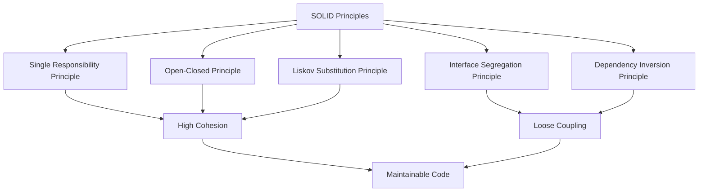
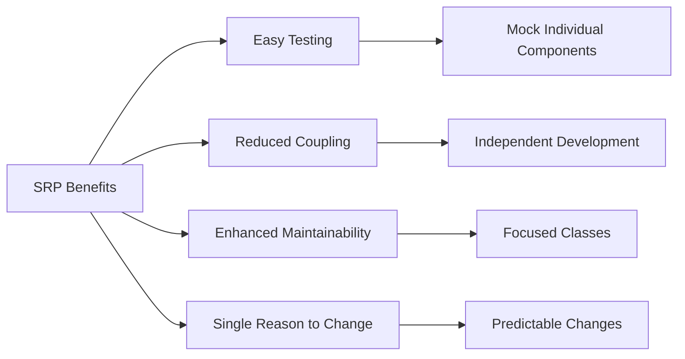
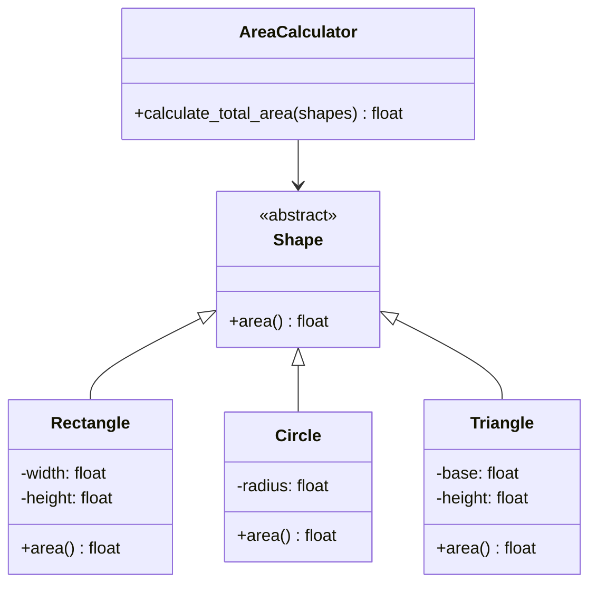
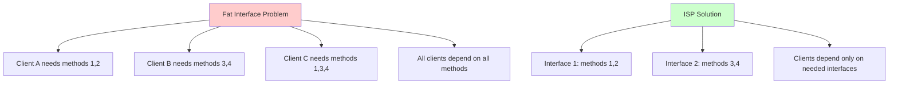
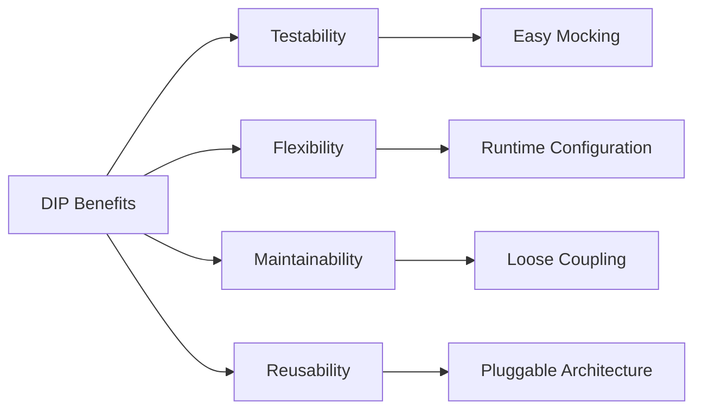

# SOLID Design Principles in Python

The SOLID principles, coined by Robert C. Martin (“Uncle Bob”), are five fundamental design principles that help create maintainable, flexible, and robust object-oriented software. These principles promote **high cohesion**, **loose coupling**, and **reusability**.

## Overview



-----

## 1. Single Responsibility Principle (SRP)

> **“A class should have only one reason to change”**

### The Problem: Too Many Responsibilities

```python
# ❌ Violates SRP - Multiple responsibilities
class UserManager:
    def __init__(self):
        self.users = []
    
    def add_user(self, user):
        """User management responsibility"""
        self.users.append(user)
    
    def send_email(self, user, message):
        """Email responsibility"""
        print(f"Sending email to {user}: {message}")
    
    def save_to_database(self, user):
        """Database responsibility"""
        print(f"Saving {user} to database")
    
    def generate_report(self):
        """Reporting responsibility"""
        return f"Report: {len(self.users)} users"
```

**Problems with this approach:**

- Changes to email logic require modifying UserManager
- Database changes affect the user management class
- Hard to test individual responsibilities
- Violates the principle of separation of concerns

### The Solution: Separate Responsibilities

```python
# ✅ Follows SRP - Single responsibility per class
class User:
    def __init__(self, name, email):
        self.name = name
        self.email = email

class UserRepository:
    """Handles user storage and retrieval"""
    def __init__(self):
        self.users = []
    
    def add_user(self, user):
        self.users.append(user)
    
    def get_users(self):
        return self.users

class EmailService:
    """Handles email operations"""
    def send_email(self, user, message):
        print(f"Sending email to {user.email}: {message}")

class DatabaseService:
    """Handles database operations"""
    def save_user(self, user):
        print(f"Saving {user.name} to database")

class UserReportGenerator:
    """Handles report generation"""
    def __init__(self, user_repository):
        self.user_repository = user_repository
    
    def generate_report(self):
        users = self.user_repository.get_users()
        return f"Report: {len(users)} users"
```

### Benefits of SRP



-----

## 2. Open-Closed Principle (OCP)

> **“Software entities should be open for extension, but closed for modification”**

### The Problem: Modification Required for Extension

```python
# ❌ Violates OCP - Must modify existing code to add new shapes
class AreaCalculator:
    def calculate_area(self, shapes):
        total_area = 0
        for shape in shapes:
            if shape.type == "rectangle":
                total_area += shape.width * shape.height
            elif shape.type == "circle":
                total_area += 3.14159 * shape.radius ** 2
            # Adding triangle requires modifying this class
            elif shape.type == "triangle":
                total_area += 0.5 * shape.base * shape.height
        return total_area

class Rectangle:
    def __init__(self, width, height):
        self.type = "rectangle"
        self.width = width
        self.height = height
```

### The Solution: Abstraction and Polymorphism

```python
# ✅ Follows OCP - Open for extension, closed for modification
from abc import ABC, abstractmethod
import math

class Shape(ABC):
    """Abstract base class - closed for modification"""
    @abstractmethod
    def area(self):
        pass

class Rectangle(Shape):
    """Extension without modifying existing code"""
    def __init__(self, width, height):
        self.width = width
        self.height = height
    
    def area(self):
        return self.width * self.height

class Circle(Shape):
    """Extension without modifying existing code"""
    def __init__(self, radius):
        self.radius = radius
    
    def area(self):
        return math.pi * self.radius ** 2

class Triangle(Shape):
    """New shape added without touching existing classes"""
    def __init__(self, base, height):
        self.base = base
        self.height = height
    
    def area(self):
        return 0.5 * self.base * self.height

class AreaCalculator:
    """Never needs modification when new shapes are added"""
    def calculate_total_area(self, shapes):
        return sum(shape.area() for shape in shapes)

# Usage example
calculator = AreaCalculator()
shapes = [
    Rectangle(5, 4),
    Circle(3),
    Triangle(6, 8)
]
total = calculator.calculate_total_area(shapes)
print(f"Total area: {total}")
```

### OCP Architecture



-----

## 3. Liskov Substitution Principle (LSP)

> **“Subtypes must be substitutable for their base types”**

### The Problem: Behavioral Inconsistency

```python
# ❌ Violates LSP - Square changes Rectangle's expected behavior
class Rectangle:
    def __init__(self, width, height):
        self._width = width
        self._height = height
    
    def set_width(self, width):
        self._width = width
    
    def set_height(self, height):
        self._height = height
    
    def area(self):
        return self._width * self._height

class Square(Rectangle):
    """Violates LSP - breaks Rectangle's width/height independence"""
    def set_width(self, width):
        self._width = width
        self._height = width  # Breaks Rectangle's contract!
    
    def set_height(self, height):
        self._width = height
        self._height = height  # Breaks Rectangle's contract!

# This function expects Rectangle behavior
def test_rectangle_behavior(rectangle):
    rectangle.set_width(5)
    rectangle.set_height(4)
    expected_area = 20
    actual_area = rectangle.area()
    assert actual_area == expected_area, f"Expected {expected_area}, got {actual_area}"

# This breaks with Square!
rectangle = Rectangle(0, 0)
test_rectangle_behavior(rectangle)  # ✅ Works

square = Square(0, 0)
test_rectangle_behavior(square)  # ❌ Fails! Area is 16, not 20
```

### The Solution: Proper Abstraction

```python
# ✅ Follows LSP - Proper inheritance hierarchy
from abc import ABC, abstractmethod

class Shape(ABC):
    """Common interface for all shapes"""
    @abstractmethod
    def area(self):
        pass

class Rectangle(Shape):
    """Rectangle with independent width and height"""
    def __init__(self, width, height):
        self._width = width
        self._height = height
    
    def set_width(self, width):
        self._width = width
    
    def set_height(self, height):
        self._height = height
    
    def area(self):
        return self._width * self._height

class Square(Shape):
    """Square with unified side length"""
    def __init__(self, side):
        self._side = side
    
    def set_side(self, side):
        self._side = side
    
    def area(self):
        return self._side * self._side

# Now both can be used polymorphically through Shape interface
def calculate_total_area(shapes):
    return sum(shape.area() for shape in shapes)

shapes = [Rectangle(5, 4), Square(3)]
total = calculate_total_area(shapes)  # Works correctly!
```

### LSP Design by Contract

**For LSP compliance, subclasses must:**

- **Preconditions**: Cannot be stronger than the base class
- **Postconditions**: Cannot be weaker than the base class
- **Invariants**: Must be preserved

```python
class Bird(ABC):
    """Contract: All birds can move"""
    @abstractmethod
    def move(self):
        """Postcondition: Bird changes position"""
        pass

class FlyingBird(Bird):
    """Strengthens the contract - can fly"""
    def move(self):
        return "Flying through the air"

class Penguin(Bird):
    """Different implementation, same contract"""
    def move(self):
        return "Swimming through water"

# Both satisfy the Bird contract
def make_bird_move(bird: Bird):
    return bird.move()
```

-----

## 4. Interface Segregation Principle (ISP)

> **“Clients should not be forced to depend on interfaces they don’t use”**

### The Problem: Fat Interfaces

```python
# ❌ Violates ISP - Fat interface forces unnecessary dependencies
class MultiFunctionDevice(ABC):
    """Fat interface - not all devices support all functions"""
    @abstractmethod
    def print_document(self, document):
        pass
    
    @abstractmethod
    def scan_document(self):
        pass
    
    @abstractmethod
    def fax_document(self, document):
        pass
    
    @abstractmethod
    def photocopy_document(self, document):
        pass

class SimplePrinter(MultiFunctionDevice):
    """Forced to implement methods it doesn't support"""
    def print_document(self, document):
        print(f"Printing: {document}")
    
    def scan_document(self):
        raise NotImplementedError("Simple printer cannot scan")
    
    def fax_document(self, document):
        raise NotImplementedError("Simple printer cannot fax")
    
    def photocopy_document(self, document):
        raise NotImplementedError("Simple printer cannot photocopy")
```

### The Solution: Interface Segregation

```python
# ✅ Follows ISP - Segregated interfaces
from abc import ABC, abstractmethod

class Printer(ABC):
    """Small, focused interface"""
    @abstractmethod
    def print_document(self, document):
        pass

class Scanner(ABC):
    """Small, focused interface"""
    @abstractmethod
    def scan_document(self):
        pass

class FaxMachine(ABC):
    """Small, focused interface"""
    @abstractmethod
    def fax_document(self, document):
        pass

class PhotoCopier(ABC):
    """Small, focused interface"""
    @abstractmethod
    def photocopy_document(self, document):
        pass

# Implementations only depend on what they need
class SimplePrinter(Printer):
    """Only implements what it supports"""
    def print_document(self, document):
        print(f"Printing: {document}")

class BasicScanner(Scanner):
    """Only implements what it supports"""
    def scan_document(self):
        return "Scanned document"

class MultiFunctionPrinter(Printer, Scanner, PhotoCopier):
    """Implements multiple interfaces as needed"""
    def print_document(self, document):
        print(f"MFP Printing: {document}")
    
    def scan_document(self):
        return "MFP Scanned document"
    
    def photocopy_document(self, document):
        scanned = self.scan_document()
        self.print_document(scanned)
        return "Photocopied"

# Client code depends only on what it needs
class PrintManager:
    def __init__(self, printer: Printer):
        self.printer = printer  # Only depends on Printer interface
    
    def print_report(self, report):
        self.printer.print_document(report)
```

### ISP Architecture



-----

## 5. Dependency Inversion Principle (DIP)

> **“High-level modules should not depend on low-level modules. Both should depend on abstractions.”**

### The Problem: Direct Dependencies

```python
# ❌ Violates DIP - High-level module depends on low-level implementation
class EmailService:
    """Low-level module"""
    def send_email(self, message, recipient):
        print(f"Sending email to {recipient}: {message}")

class SMSService:
    """Low-level module"""
    def send_sms(self, message, phone):
        print(f"Sending SMS to {phone}: {message}")

class NotificationManager:
    """High-level module directly depends on low-level modules"""
    def __init__(self):
        self.email_service = EmailService()  # Direct dependency!
        self.sms_service = SMSService()      # Direct dependency!
    
    def send_notification(self, message, contact, method):
        if method == "email":
            self.email_service.send_email(message, contact)
        elif method == "sms":
            self.sms_service.send_sms(message, contact)
```

### The Solution: Dependency Injection

```python
# ✅ Follows DIP - Depend on abstractions
from abc import ABC, abstractmethod
from typing import List

class NotificationService(ABC):
    """Abstraction that both high and low-level modules depend on"""
    @abstractmethod
    def send(self, message: str, recipient: str):
        pass

class EmailService(NotificationService):
    """Low-level module implementing the abstraction"""
    def send(self, message: str, recipient: str):
        print(f"Email to {recipient}: {message}")

class SMSService(NotificationService):
    """Low-level module implementing the abstraction"""
    def send(self, message: str, recipient: str):
        print(f"SMS to {recipient}: {message}")

class PushNotificationService(NotificationService):
    """Easy to add new services without changing high-level code"""
    def send(self, message: str, recipient: str):
        print(f"Push notification to {recipient}: {message}")

class NotificationManager:
    """High-level module depends on abstraction"""
    def __init__(self, services: List[NotificationService]):
        self.services = services  # Dependency injection!
    
    def send_notification(self, message: str, recipient: str):
        """Send via all configured services"""
        for service in self.services:
            service.send(message, recipient)
    
    def add_service(self, service: NotificationService):
        """Open for extension"""
        self.services.append(service)

# Usage with dependency injection
email_service = EmailService()
sms_service = SMSService()
push_service = PushNotificationService()

# Inject dependencies
notification_manager = NotificationManager([email_service, sms_service])
notification_manager.send_notification("Hello!", "user@example.com")

# Easy to extend
notification_manager.add_service(push_service)
```

### Dependency Injection Patterns

```python
# Constructor Injection (most common)
class OrderService:
    def __init__(self, payment_processor: PaymentProcessor):
        self.payment_processor = payment_processor

# Setter Injection
class OrderService:
    def set_payment_processor(self, payment_processor: PaymentProcessor):
        self.payment_processor = payment_processor

# Interface Injection
class PaymentProcessorAware(ABC):
    @abstractmethod
    def set_payment_processor(self, processor: PaymentProcessor):
        pass
```

### DIP Benefits



-----

## Putting It All Together: Complete Example

```python
from abc import ABC, abstractmethod
from typing import List, Optional

# Domain Models (SRP)
class User:
    def __init__(self, name: str, email: str):
        self.name = name
        self.email = email

class Order:
    def __init__(self, user: User, amount: float):
        self.user = user
        self.amount = amount
        self.status = "pending"

# Abstractions (DIP, ISP)
class PaymentProcessor(ABC):
    @abstractmethod
    def process_payment(self, amount: float) -> bool:
        pass

class NotificationService(ABC):
    @abstractmethod
    def send_notification(self, user: User, message: str):
        pass

class OrderRepository(ABC):
    @abstractmethod
    def save_order(self, order: Order):
        pass

# Implementations (LSP, OCP)
class CreditCardProcessor(PaymentProcessor):
    def process_payment(self, amount: float) -> bool:
        print(f"Processing ${amount} via credit card")
        return True

class PayPalProcessor(PaymentProcessor):
    def process_payment(self, amount: float) -> bool:
        print(f"Processing ${amount} via PayPal")
        return True

class EmailNotificationService(NotificationService):
    def send_notification(self, user: User, message: str):
        print(f"Email to {user.email}: {message}")

class DatabaseOrderRepository(OrderRepository):
    def save_order(self, order: Order):
        print(f"Saving order for {order.user.name} to database")

# High-level service (DIP, SRP)
class OrderService:
    def __init__(self, 
                 payment_processor: PaymentProcessor,
                 notification_service: NotificationService,
                 order_repository: OrderRepository):
        self.payment_processor = payment_processor
        self.notification_service = notification_service
        self.order_repository = order_repository
    
    def process_order(self, order: Order) -> bool:
        # Single responsibility: orchestrate order processing
        if self.payment_processor.process_payment(order.amount):
            order.status = "completed"
            self.order_repository.save_order(order)
            self.notification_service.send_notification(
                order.user, 
                f"Order completed! Amount: ${order.amount}"
            )
            return True
        return False

# Usage
user = User("John Doe", "john@example.com")
order = Order(user, 99.99)

# Dependency injection
payment_processor = CreditCardProcessor()
notification_service = EmailNotificationService()
order_repository = DatabaseOrderRepository()

order_service = OrderService(
    payment_processor,
    notification_service,
    order_repository
)

# Process order
success = order_service.process_order(order)
```

## Summary

The SOLID principles work together to create flexible, maintainable code:

1. **SRP**: Each class has one reason to change
1. **OCP**: Extend behavior without modifying existing code
1. **LSP**: Subtypes are substitutable for their base types
1. **ISP**: Depend only on the interfaces you need
1. **DIP**: Depend on abstractions, not concretions

These principles lead to code that is easier to test, maintain, and extend - the hallmarks of quality software design.
